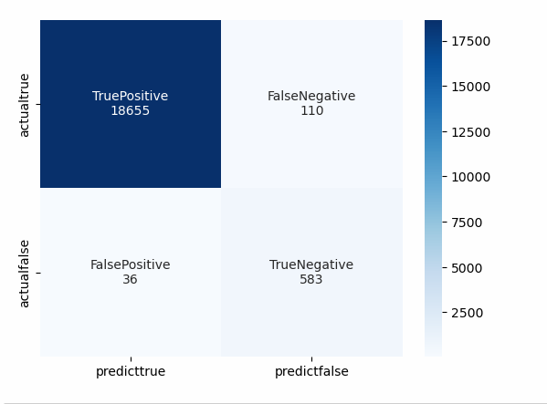

# Module 20 Credit Risk Analysis Report
## Overview 
1. **The purpose of the analysis**
	The analysis uses historical data to train and evaluate a model to show the loan risk and identify the borrowers' creditworthiness and the interest rate they will pay on their loans. Within that model, it will show the lending activity from a peer-to-peer company and whether lending money to customers is safe or risky. Also, it will show if the borrowers are paying their loans on time and if they are defaulting on their loans. 
2. **About the Data**
	The data is split up into training and testing data. The data here is a large one, it has about eight columns and about 77,536 rows. It has several columns that show the loan size, the interest rate, the income of the borrower, the number of opened accounts, derogatory marks that show the negative items on the credit report, and the debt the borrower has. Also, that data shows the status of the loan, which means whether the loan is timely paid and if there are missed payments. 
3. **Machine Learing Process**
	The Machine Learning Process has features: the size of the loan, the interest rate, the income of the borrower, the number of accounts that are opened, derogatory marks that show the negative items on the credit report, and the total debt that the borrower has. Also, it has a label that shows the status of the loan. Using that data, we can do a first model and an oversampling data. We can calculate the precision, accuracy, and recall level from these two models. 

4. **Machine Learning Packages**     
```python 
import numpy as np
import pandas as pd
from pathlib import Path
from sklearn.metrics import balanced_accuracy_score, confusion_matrix, classification_report
from sklearn.model_selection import train_test_split
from sklearn.linear_model import LogisticRegression
from imblearn.over_sampling import RandomOverSampler
``` 
## Machine Learning Results
**First Model**      

1. For accuracy    
Accuracy=(TruePositive+TrueNegative)/(TruePositive+TrueNegative+FalsePositive+FalseNegative)=(18655+583)/(18655+583+36+110)=99.24%
2. For Percision
Percision=TruePositive/(TruePositive+FalsePositive)=18655/(18655+36)=99.80%
3. Recall
recall=TruePositive/(TruePositive+FalseNegative)=18655/(18655+110)=99.41%    
**Oversampling Data**       

1. For accuracy    
Accuracy=(TruePositive+TrueNegative)/(TruePositive+TrueNegative+FalsePositive+FalseNegative)=(18646+615)/(18646+615+4+119)=99.36%
2. For Percision
Percision=TruePositive/(TruePositive+FalsePositive)=18646/(18646+4)=99.97%
3. Recall
recall=TruePositive/(TruePositive+FalseNegative)=18646/(18646+119)=99.36%      


## Conclusion
The precision for the  class (0) is 100% which means the model correctly made the positive prediction everytime. The recall of that class is 99%.            

The precision for class (1) is not good as expected because the percision is only 84%, but the recall for class (1) is acceptable, it predicted a higher risk sample.       

On the other hand, the previous model recall is 94% and this oversampling recall model is 99%, which means this model has a higher standard because the recall is high. At the new standard, the percision is 84%. 